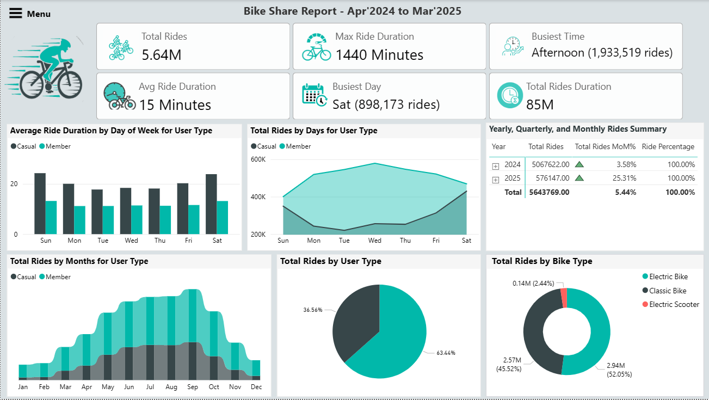

# Bike-Share User Behavior Analysis (Apr 2024 – Mar 2025)

This case study explores behavioral differences between **annual members** and **casual riders** in a bike-share system, using 12 months of data.

---

## Business Task

**Identify and analyze behavioral differences between annual members and casual riders** to support the marketing team in designing strategies that convert casual users into annual members.

---

## Tools Used

- **Python**: Pandas, Numpy, Seaborn, Matplotlib (data cleaning, transformation, and EDA)
- **Power BI**: Dimensional modeling (star schema), DAX measures, interactive dashboard
- **Git & GitHub**: Version control and portfolio hosting

---

## Project Structure

| Folder        | Description                                 |
|---------------|---------------------------------------------|
| `notebooks/`  | Jupyter Notebook for data merging, cleaning, EDA |
| `powerbi/`    | Power BI `.pbix` file and dashboard screenshot   |
| `data/`       | Sample data file (`.csv`) for demonstration      |
| `README.md`   | Project overview, insights, and recommendations  |
| `LICENSE`     | MIT License file (permissions & usage)           |

---

## Data Source

-  **Time Period**: April 2024 to March 2025  
-  [Divvy Trip Data (Public)](https://divvy-tripdata.s3.amazonaws.com/index.html)

---

## Data Cleaning & Transformation (Python)

- Appended 12 monthly `.csv` files into one DataFrame
- Removed 211 duplicate `ride_id` values
- Dropped unused station/location columns
- Handled missing values and outliers:
  - Removed rides over 24 hours or with negative durations
- Created time-based features:  
  `start_date`, `start_time`, `day_name`, `month_name`, `quarter`, `time_period`
- Exported cleaned data to `.parquet` for efficient loading in Power BI

 Code: [`notebooks/cleaning_eda.ipynb`](notebooks/eda_cleaning.ipynb)

---

## Exploratory Data Analysis (Python)

- Monthly ride distribution
- Ride durations by user type
- Usage by weekday and hour
- Time period preferences (morning, afternoon, etc.)
- Null heatmap for data quality

---

## Power BI Dashboard

- Built a **star schema** data model in Power BI
- Defined **DAX measures** for key metrics
- Created visuals for trends over time, user types, and bike types
- Included filter panel for dynamic exploration

Dashboard Preview:  

---

## Key Insights

- **Casual riders** prefer weekends and afternoons  
- **Members** ride more during weekdays and commute hours  
- Casual users take **longer trips** on average  
- High seasonal usage during **summer months**

---

## Recommendations

- Promote memberships during weekends and summer peaks
- **Introduce a monthly membership plan** to attract casual riders who aren’t ready to commit to an annual plan
- Offer bundle discounts to casual users
- Use email campaigns to highlight member benefits

---

## License

This project is licensed under the [MIT License](LICENSE)

---

## About Me

**Aymen Mohammed** — Data Analyst passionate about using data to tell stories and drive business decisions.

 // 
 //
